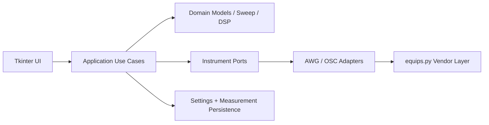
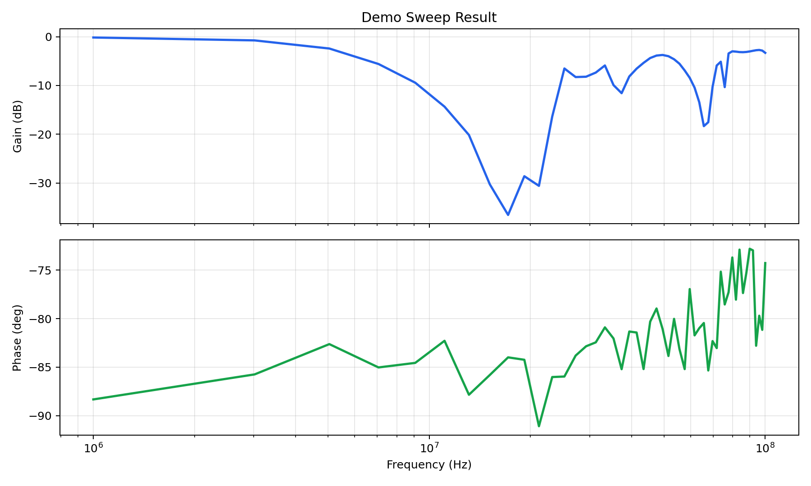

# Auto-Load-off-Test

[](https://github.com/lishehao-ctrl/Auto-Load-off-Test/actions/workflows/ci.yml)

Auto-Load-off-Test is a local Python desktop tool for AWG/oscilloscope sweep measurement, calibration, plotting, and data export.

It turns a repetitive manual lab workflow into a layered application:

- configure an arbitrary waveform generator (AWG)
- configure oscilloscope acquisition channels
- sweep frequency points
- measure gain and optional phase
- apply reference calibration
- export MAT/CSV/TXT data and optional plot images

## Why It Exists

Manual AWG/oscilloscope sweep measurements are repetitive and easy to misconfigure. This project separates the workflow into testable layers so the sweep math, signal processing, settings serialization, and use-case flow can be verified without physical instruments.

## Architecture

```text
src/
  main.py
  app/
    bootstrap.py             desktop composition root
    runtime/                 runtime paths and environment helpers
    presentation/tk/        Tkinter UI and plotting
    application/            use cases, DTOs, events, ports
    domain/                 pure models, validation, sweep math, DSP
    infrastructure/         instrument adapters and persistence
  equips.py                 legacy vendor/instrument compatibility layer
```



The UI and use cases do not call `src/equips.py` directly. That file is treated as a legacy vendor compatibility layer and is wrapped by infrastructure adapters.

## Requirements

- Python 3.10 or newer
- Tkinter, usually included with the Python installer on macOS/Windows
- For live instrument use:
  - supported AWG and oscilloscope models from `src/app/shared/mapping.py`
  - VISA access through `pyvisa` / `pyvisa-py`
  - a working VISA backend for the connection type, such as NI-VISA / Keysight IO Libraries for LAN/USB/GPIB or the extra USB/GPIB libraries required by `pyvisa-py`
  - correct LAN/VISA addresses for the instruments

Automated tests do not require AWG/OSC hardware.

## Install

```bash
python3 -m venv .venv
source .venv/bin/activate
python -m pip install --upgrade pip
python -m pip install -r requirements.txt
```

For development tooling:

```bash
python -m pip install -r requirements-dev.txt
```

The project also exposes an optional console script when installed as a package:

```bash
python -m pip install -e .
auto-load-off-test
```

## Run The Desktop App

```bash
python src/main.py
```

Settings and auto-save data are rooted at the process working directory unless `AUTO_LOAD_OFF_TEST_ROOT` is set. From the repo root, settings are stored at:

```text
__config__/settings.json
```

For packaged installs or lab workstations, set `AUTO_LOAD_OFF_TEST_ROOT` to an explicit writable directory so settings and `__data__/measurement/` do not move when the app is launched from a different shell directory.

## Run Tests Without Hardware

```bash
PYTHONPATH=src python -m unittest discover -s tests
```

The test suite uses pure domain tests and mocked instrument ports. It covers sweep generation, signal processing, settings serialization, measurement I/O, start-sweep event flow, and the sweep task runner.

## Output Files

Saving a measurement writes:

- `*.mat`
- `*.csv`
- `*.txt`
- `*_gain.png` and `*_gain_db.png` when plot figures are supplied

Auto-save writes timestamped files under:

```text
__data__/measurement/
```

Example result generated from `demo_data/Demo(2).mat`:



## Safety Notes

This is a local lab automation tool, not a certified production test platform. Operators are responsible for confirming the connected instrument model, address, voltage range, frequency range, impedance, coupling, and device-under-test limits before running a live sweep.

See [docs/safety.md](docs/safety.md) for stop/shutdown behavior and hardware assumptions.

## Documentation

- [Architecture](docs/architecture.md)
- [Operator Guide](docs/operator_guide.md)
- [Safety Notes](docs/safety.md)
- [Extending The Application](docs/extending.md)
- [Case Study](docs/case_study.md)
- [Demo Data](demo_data/README.md)

## Project Status

The refactored app is local, single-process, and hardware-adapter based. Its strongest engineering signal is the separation between UI, use-case orchestration, pure domain logic, persistence, and instrument side effects.
