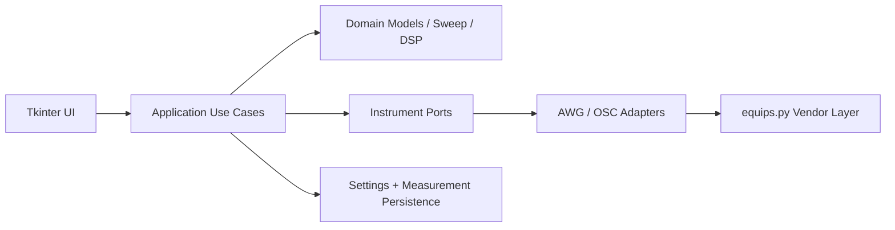
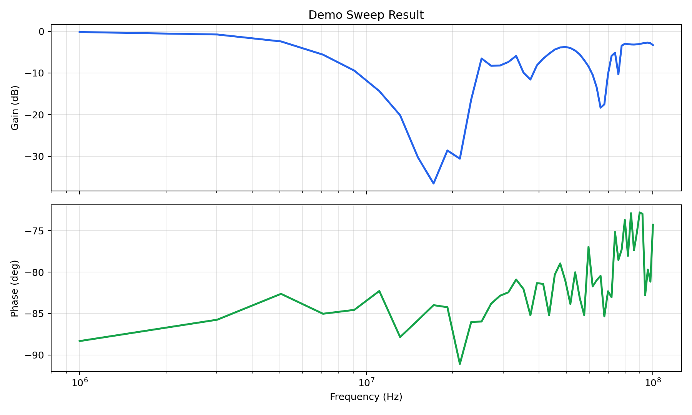

# Auto-Load-off-Test

[](https://github.com/lishehao/auto-load-off-test/actions/workflows/ci.yml)

Auto-Load-off-Test is a local Python desktop tool for AWG/oscilloscope sweep measurement, calibration, plotting, and data export.

It turns a repetitive manual lab workflow into a layered application:

- configure an arbitrary waveform generator (AWG)
- configure oscilloscope acquisition channels
- sweep frequency points
- measure gain and optional phase
- apply reference calibration
- export MAT/CSV/TXT data and optional plot images

## Evidence Status

This table is intentionally conservative. See the detailed [validation matrix](docs/validation_matrix.md).

| Surface | Inspectable evidence | Boundary |
| --- | --- | --- |
| Hardware-free core | Cross-platform unit tests, fake instrument ports, capability-aware preflight, strict measurement/reference validation, and a deterministic fixture/reference/correction/export/reload workflow. | Validates software behavior and data contracts without instruments. |
| Operator console | Real Tkinter window capture with 72-point replay, log Bode display, progress, source/safety receipts, and MAT/CSV/TXT export. | The replay is simulated and explicitly labeled; production instrument adapters are not used. |
| Windows distribution | PyInstaller one-folder build plus an automated packaged fixture/export/reload smoke and machine-readable receipt. | Does not install VISA drivers, prove Windows GUI rendering on every host, or validate connected instruments. |
| Live instruments | Capability profiles and production adapters are present, but there is no current public bench-validation record. | Do not claim live AWG/oscilloscope, metrology, or production-system validation. |

## Demo

[](https://youtu.be/fYokRzNnm84)

[Watch the point-by-point operator console demo on YouTube](https://youtu.be/fYokRzNnm84)

The published YouTube walkthrough shows the real Tkinter operator console replaying a deterministic 72-point
fixture point by point. The repository poster and local MP4 are a newer recapture of the same workflow; they
also show the log-frequency gain/phase display, progress and latest-frequency updates, neutral `AWG/OSC not used`
status, the loaded 72-point reference/coverage receipt, and an export receipt.

It is labeled `No hardware - simulated fixture`: the production AWG/oscilloscope adapters are not used
in this demo, and it is not live hardware validation.

For offline review, the recaptured current-UI artifact is available as a
[local MP4 fallback](docs/images/auto-load-off-test-point-replay-demo.mp4).

## Why It Exists

Manual AWG/oscilloscope sweep measurements are repetitive and easy to misconfigure. This project separates the workflow into testable layers so the sweep math, signal processing, settings serialization, and use-case flow can be verified without physical instruments.

## Architecture

```text
src/
  main.py
  app/
    bootstrap.py             desktop composition root
    runtime/                 runtime paths and environment helpers
    presentation/tk/        Tkinter UI and plotting
    application/            use cases, DTOs, events, ports
    domain/                 models, capability profiles, validation, sweep math, DSP
    infrastructure/         adapter registry, discovery, instrument IO, persistence
    demo/                   deterministic no-hardware fixture and package smoke
  equips.py                 legacy vendor/instrument compatibility layer
```


```mermaid
flowchart LR
  UI["Tkinter UI"] --> APP["Application Use Cases"]
  APP --> DOMAIN["Domain Models / Sweep / DSP"]
  APP --> PORTS["Instrument Ports"]
  PORTS --> INFRA["AWG / OSC Adapters"]
  INFRA --> LEGACY["equips.py Vendor Layer"]
  APP --> PERSIST["Settings + Measurement Persistence"]
```

The UI and use cases do not call `src/equips.py` directly. That file is treated as a legacy vendor compatibility
layer and is wrapped by registered infrastructure adapters. Supported model metadata comes from the capability
registry rather than UI string dispatch.

## Requirements

- Python 3.10 or newer
- Tkinter, usually included with the Python installer on macOS/Windows
- For live instrument use:
  - a model with a registered capability profile and production adapter
  - VISA access through `pyvisa` / `pyvisa-py`
  - a working VISA backend for the connection type, such as NI-VISA / Keysight IO Libraries for LAN/USB/GPIB or the extra USB/GPIB libraries required by `pyvisa-py`
  - correct LAN/VISA addresses for the instruments

Automated tests do not require AWG/OSC hardware.

## Install

```bash
python3 -m venv .venv
source .venv/bin/activate
python -m pip install --upgrade pip
python -m pip install -r requirements.txt
```

For development tooling:

```bash
python -m pip install -r requirements-dev.txt
```

The project also exposes an optional console script when installed as a package:

```bash
python -m pip install -e .
auto-load-off-test
```

## Run The Desktop App

```bash
python src/main.py
```

Settings and auto-save data are rooted at the process working directory unless `AUTO_LOAD_OFF_TEST_ROOT` is set. From the repo root, settings are stored at:

```text
__config__/settings.json
```

For packaged installs or lab workstations, set `AUTO_LOAD_OFF_TEST_ROOT` to an explicit writable directory so settings and `__data__/measurement/` do not move when the app is launched from a different shell directory.

## Run Tests Without Hardware

```bash
PYTHONPATH=src python -m unittest discover -s tests
```

The suite covers sweep generation, DSP, capability validation, adapter/discovery fakes, settings serialization,
strict measurement/reference schemas, deterministic calibration/export round trips, UI receipt state, task-runner
cleanup, and the no-hardware package smoke. CI runs the suite on Linux, macOS, and Windows and also builds the
Windows one-folder artifact.

## Output Files

Saving a measurement writes:

- `*.mat`
- `*.csv`
- `*.txt`
- `*_gain.png` and `*_gain_db.png` when plot figures are supplied

Auto-save writes timestamped files under:

```text
__data__/measurement/
```

Example result generated from `demo_data/Demo(2).mat`:



For application-material capture without connected instruments, see the deterministic Hyperframe fixture in
`demo_data/hyperframe_simulated_fixture.*`. It should be labeled `No hardware - simulated fixture` and is not live
hardware validation.

## Safety Notes

This is a local lab automation tool, not a certified production test platform. Operators are responsible for confirming the connected instrument model, address, voltage range, frequency range, impedance, coupling, and device-under-test limits before running a live sweep.

See [docs/safety.md](docs/safety.md) for stop/shutdown behavior and hardware assumptions.

## Documentation

- [Architecture](docs/architecture.md)
- [Validation Matrix](docs/validation_matrix.md)
- [Operator Guide](docs/operator_guide.md)
- [Safety Notes](docs/safety.md)
- [Extending The Application](docs/extending.md)
- [Packaging](docs/packaging.md)
- [Case Study](docs/case_study.md)
- [Hyperframe Demo Fixture](docs/hyperframe_demo.md)
- [Hyperframe Capture Plan](docs/hyperframe_capture_plan.md)
- [Demo Data](demo_data/README.md)

## Evidence Map

- Architecture and code boundaries: [docs/architecture.md](docs/architecture.md)
- Hardware-free vs live validation boundary: [docs/validation_matrix.md](docs/validation_matrix.md)
- Operator workflow: [docs/operator_guide.md](docs/operator_guide.md)
- Hardware and safety boundary: [docs/safety.md](docs/safety.md)
- No-hardware fixture/demo boundary: [docs/hyperframe_demo.md](docs/hyperframe_demo.md)
- Deterministic demo data: [demo_data/README.md](demo_data/README.md)
- End-to-end fixture correction/export test: [tests/test_hardware_free_workflow.py](tests/test_hardware_free_workflow.py)
- Packaged no-hardware smoke: [src/app/demo/package_smoke.py](src/app/demo/package_smoke.py)
- CI workflow: [.github/workflows/ci.yml](.github/workflows/ci.yml)

## Project Status

The refactored app is local, single-process, and hardware-adapter based. Its strongest engineering signal is the separation between UI, use-case orchestration, pure domain logic, persistence, and instrument side effects.

Current public validation is hardware-free: cross-platform tests, mocked/fake instrument paths, strict data
contracts, deterministic fixture correction/replay, export round trips, a real Tk UI capture, and a packaged
Windows smoke. Live hardware validation remains future work and should not be claimed from this repository alone.
