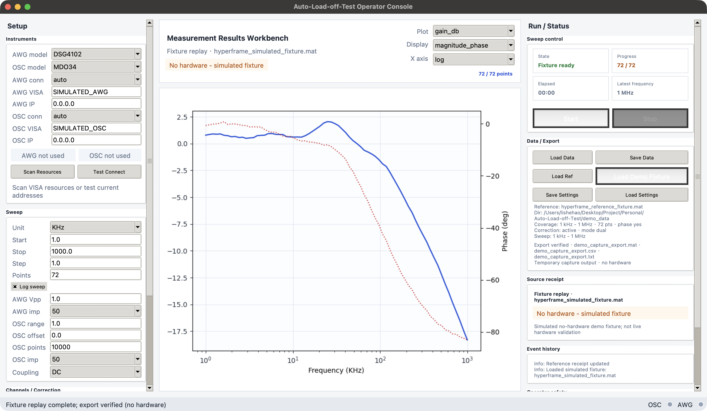
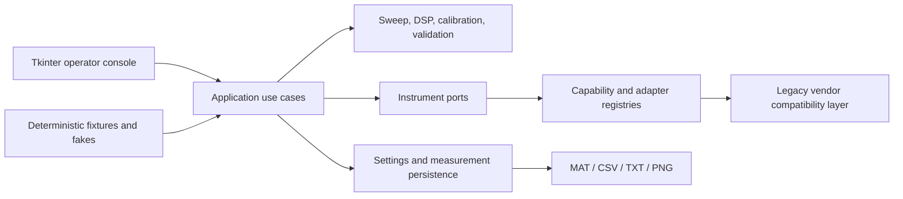

<h1 align="center">Auto-Load-off-Test</h1>

<p align="center">
  <strong>A layered Python/Tkinter operator console for repeatable AWG-oscilloscope sweep workflows.</strong>
</p>

<p align="center">
  Frequency sweep orchestration, gain/phase analysis, reference correction, operator receipts, and analysis-ready export.
</p>

<p align="center">
  <a href="https://github.com/lishehao/auto-load-off-test/actions/workflows/ci.yml"></a>
  
  
</p>

<p align="center">
  <a href="#demo">Demo</a> &middot;
  <a href="#engineering-evidence">Engineering Evidence</a> &middot;
  <a href="#architecture">Architecture</a> &middot;
  <a href="#reproduce">Reproduce</a> &middot;
  <a href="docs/case_study.md">Case Study</a>
</p>

Auto-Load-off-Test refactors a tightly coupled lab script into a testable desktop application. The design separates
operator UI, use-case orchestration, sweep and signal-processing logic, persistence, and model-specific instrument
side effects. This makes the core workflow reproducible without requiring access to a physical lab bench.

> **Validation boundary:** current public evidence is hardware-free. Production adapter paths are inspectable, but
> this repository does not claim current live AWG/oscilloscope, metrology, or production-safety validation.

## Demo

[](https://youtu.be/fYokRzNnm84)

<p align="center">
  <a href="https://youtu.be/fYokRzNnm84"><strong>Watch the operator console demo on YouTube</strong></a>
</p>

The linked walkthrough and repository recapture both use the real Tkinter application to replay a deterministic
72-point fixture from an empty plot to a complete Bode result. Progress, latest frequency, reference coverage,
correction state, source metadata, and export receipts update during the run. The poster and
[local MP4 fallback](docs/images/auto-load-off-test-point-replay-demo.mp4) show the newer current-UI recapture.
Throughout both artifacts, the UI remains visibly labeled **No hardware - simulated fixture**; production instrument
adapters are not invoked.

## Project At A Glance

| | |
| --- | --- |
| **Problem** | Manual generator/oscilloscope sweeps are repetitive, stateful, and easy to misconfigure. |
| **Workflow** | Configure a sweep, acquire gain/phase, apply a reference, inspect progress and warnings, then export results. |
| **Engineering approach** | Layered presentation, application, domain, persistence, and instrument-adapter boundaries. |
| **Stack** | Python 3.10+, Tkinter/ttk, Matplotlib, NumPy, SciPy, PyVISA, PyInstaller. |
| **Reproducible evidence** | Deterministic fixture/reference data, fake instrument ports, strict IO contracts, cross-platform CI, and a packaged Windows smoke. |
| **Current boundary** | Software and no-hardware workflows are validated; connected instruments and electrical behavior are not. |

## Engineering Evidence

### 1. Isolated hardware side effects

Application services depend on explicit [AWG/oscilloscope ports](src/app/application/ports/instruments.py), not on
vendor commands. A [capability registry](src/app/domain/instrument_capabilities.py) defines model constraints, while
the [adapter registry](src/app/infrastructure/instruments/adapter_registry.py) resolves production and fake paths.
The original [`equips.py`](src/equips.py) module remains isolated as a legacy compatibility layer instead of being
broadly rewritten without a physical regression bench.

### 2. Strict measurement and calibration contracts

[Boundary validation](src/app/domain/data_validation.py) rejects missing fields, length mismatches, non-finite gain,
and non-positive, duplicate, or unsorted frequencies. The deterministic
[end-to-end workflow test](tests/test_hardware_free_workflow.py) reconstructs corrected gain and phase from raw plus
reference curves, compares expected values, exports MAT/CSV/TXT, reloads MAT/CSV, and verifies source metadata.

### 3. Operator state is part of the system design

The console distinguishes `live`, `loaded`, and `fixture` data sources. Long-running sweeps report point-level
progress without blocking the Tk event loop; stop, cleanup, reference coverage, correction, export artifacts, and
safety warnings remain visible as receipts instead of disappearing in transient dialogs. See the
[operator guide](docs/operator_guide.md) for the complete workflow.

### 4. Distribution is tested as a workflow

[GitHub Actions](.github/workflows/ci.yml) runs the hardware-free suite on Linux, macOS, and Windows, checks the code
with Ruff, and builds a Windows PyInstaller one-folder artifact. The bundled
[package smoke](src/app/demo/package_smoke.py) exercises fixture load, reference correction, export, and reload from
the frozen executable and records `live_hardware_used: false`. This is packaging evidence, not a certified release
or a live-VISA test.

## Architecture


```mermaid
flowchart LR
  UI["Tkinter operator console"] --> APP["Application use cases"]
  DEMO["Deterministic fixtures and fakes"] --> APP
  APP --> DOMAIN["Sweep, DSP, calibration, validation"]
  APP --> PORTS["Instrument ports"]
  PORTS --> REGISTRY["Capability and adapter registries"]
  REGISTRY --> LEGACY["Legacy vendor compatibility layer"]
  APP --> STORE["Settings and measurement persistence"]
  STORE --> FILES["MAT / CSV / TXT / PNG"]
```

The dependency direction keeps the domain and most application behavior independent from Tkinter, PyVISA, and the
legacy driver module. More detail is available in the [architecture note](docs/architecture.md) and
[case study](docs/case_study.md).

## Validation Evidence

| Surface | Current evidence | What it does not prove |
| --- | --- | --- |
| Sweep, DSP, calibration, and IO | Automated tests using pure logic, temporary files, deterministic arrays, and fake ports. | Instrument timing, acquisition fidelity, or calibration uncertainty. |
| Operator workflow | Actual Tkinter window capture from 0/72 through 72/72 with source, correction, progress, and export receipts. | A live sweep or connected-instrument workflow. |
| Resource discovery and adapter selection | Mock scanners, identity probes, capability preflight, and registry/factory tests. | Real VISA enumeration, `*IDN?` behavior, or firmware compatibility. |
| Windows packaging | CI-built one-folder executable plus frozen fixture/export/reload smoke. | Driver installation, code signing, every Windows theme, or live VISA access. |
| Stop and output-off flow | Fake-port tests for cancellation, cleanup attempts, timeouts, and warning events. | Electrical shutdown latency or fail-safe behavior on hardware. |
| Live bench and metrology | No current public validation record. | Any claim of live-instrument, metrology-grade, or production-certified operation. |

The detailed [validation matrix](docs/validation_matrix.md) maps each claim to inspectable evidence and lists wording
that is not supported by the repository.

## Reproduce

### Install and launch

```bash
python3 -m venv .venv
source .venv/bin/activate
python -m pip install --upgrade pip
python -m pip install -e .
python src/main.py
```

On Windows, activate the environment with `.venv\Scripts\activate` before installing. The installed console entry
point is also available as `auto-load-off-test`.

To inspect the workflow without instruments, launch the application and select **Load Demo Fixture**. The console
will retain the simulated/no-hardware label throughout replay and export.

### Run the hardware-free checks

```bash
PYTHONPATH=src python -m unittest discover -s tests
python -m ruff check src/app tests scripts
```

The automated suite covers sweep generation, DSP, capability validation, adapter/discovery fakes, strict
measurement/reference schemas, deterministic correction and export round trips, UI receipt state, task-runner
cleanup, and the package smoke.

## Instrument Paths

UI-visible capability profiles and legacy-compatible adapter paths currently exist for:

| Role | Registered models |
| --- | --- |
| AWG | `DSG4102`, `DSG836` |
| Oscilloscope | `MDO34`, `MDO3024`, `DHO1202`, `DHO1204` |

These names describe registered software paths, not a current live-hardware compatibility certificate. Model limits,
termination, coupling, transport, and validation status are defined in the
[capability registry](src/app/domain/instrument_capabilities.py). Test-only mock models are hidden from the UI.

## Data And Runtime Paths

Saving a measurement can produce `*.mat`, `*.csv`, `*.txt`, and optional `*_gain.png` / `*_gain_db.png` plots.
Exports preserve source, correction mode, point count, timestamp, and the simulated/live boundary when available.

By default, settings and auto-save data are rooted at the launch directory:

```text
__config__/settings.json
__data__/measurement/
```

Set `AUTO_LOAD_OFF_TEST_ROOT` to an explicit writable directory for packaged installations or lab workstations. See
the [packaging guide](docs/packaging.md) for Windows prerequisites and the no-hardware smoke checklist.

## Technical Documentation

| Topic | Document |
| --- | --- |
| Design decisions and tradeoffs | [Case Study](docs/case_study.md) |
| Layer boundaries and dependencies | [Architecture](docs/architecture.md) |
| Evidence levels and unsupported claims | [Validation Matrix](docs/validation_matrix.md) |
| Setup, replay, run, correction, and export | [Operator Guide](docs/operator_guide.md) |
| Stop behavior and operator responsibilities | [Safety Notes](docs/safety.md) |
| Adding adapters, persistence, or UI behavior | [Extending The Application](docs/extending.md) |
| Windows one-folder build and prerequisites | [Packaging](docs/packaging.md) |
| Deterministic fixture design and provenance | [Demo Fixture](docs/hyperframe_demo.md) / [Demo Data](demo_data/README.md) |

## Scope And Safety

This is a local engineering tool, not a certified production test platform. Before any live run, an operator must
confirm the physical instrument model and address, probe attenuation, voltage and frequency limits, termination,
coupling, trigger behavior, and device-under-test constraints.

Current evidence demonstrates software architecture, deterministic data handling, operator-state design, and
hardware-free distribution testing. Live VISA discovery, model/firmware compatibility, electrical output-off
latency, measurement uncertainty, calibration traceability, and safe DUT operation require a documented physical
bench matrix and remain intentionally unclaimed. See [docs/safety.md](docs/safety.md) for the full boundary.
