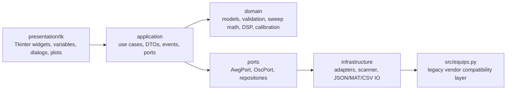

# Architecture

Auto-Load-off-Test is organized as a local desktop application with explicit boundaries between UI code, use-case orchestration, pure domain logic, persistence, and hardware side effects.

## Layer Diagram

## Layers

- `app/bootstrap.py`
  - Desktop composition root. Wires repositories, use cases, scanner, instrument factories, runtime paths, and the Tk controller.
- `app/presentation/tk`
  - Tk widgets, variable bindings, dialogs, chart rendering.
  - Consumes application events and dispatches user intents.
- `app/application`
  - Use-case orchestration for start/stop sweep, save/load, reference loading, and settings.
  - Emits typed events for UI; no Tk widgets or message boxes.
- `app/domain`
  - Pure dataclasses, enums, validation, sweep generation, DSP, calibration, and export array shaping.
- `app/infrastructure`
  - Adapter wrappers around `src/equips.py`.
  - JSON settings and MAT/CSV/TXT persistence.

## Dependency Rules

Allowed:

- `presentation -> application`
- `application -> domain`
- `application -> ports`
- `infrastructure -> ports`
- `infrastructure -> domain`
- `infrastructure -> src/equips.py`

Forbidden:

- `domain` importing Tkinter, PyVISA, serial, or Matplotlib.
- `application` showing dialogs through `messagebox` or `filedialog`.
- UI or use cases accessing `src/equips.py` directly.

## Event Flow

1. UI collects parameters from `ViewModel`.
2. `TkController` maps the view model to `AppSettings`.
3. `SweepTaskRunner` starts `StartSweepUseCase` in a worker thread.
4. Use case emits:
   - `SweepStarted`
   - `SweepProgress`
   - `SweepDataUpdated`
   - `SweepWarning` / `SweepFailed`
   - `SweepCompleted` / `SweepStopped`
5. Controller polls the event queue on the Tk main thread via `after()` and updates UI safely.

## Instrument Access

- Instrument model and address resolution go through `equips_factory`.
- AWG and OSC commands are executed through `AwgPort` and `OscPort` adapters.
- Connection scanning is provided by `PyVisaResourceScanner` and `ConnectionMonitor`.
- `src/equips.py` is intentionally treated as a vendor compatibility layer. It contains legacy SCPI/serial behavior that should not be casually refactored without physical instrument verification.

## Persistence

- Settings: `__config__/settings.json`
- Measurement files: MAT/CSV/TXT plus optional plot PNG files
- Reference files: MAT

Runtime locations are centralized through `AppPaths` in `app/runtime/paths.py`.

## Test Strategy

The automated tests stay hardware-free by using pure domain tests and fake instrument ports. Live instrument verification remains a manual/operator workflow.
