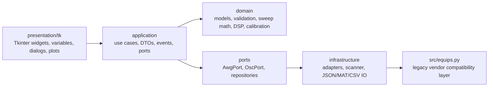
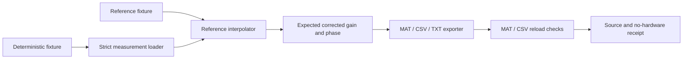

# Architecture

Auto-Load-off-Test is organized as a local desktop application with explicit boundaries between UI code, use-case orchestration, pure domain logic, persistence, and hardware side effects.

## Layer Diagram

```mermaid
flowchart LR
  UI["presentation/tk<br/>Tkinter widgets, variables, dialogs, plots"] --> APP["application<br/>use cases, DTOs, events, ports"]
  APP --> DOMAIN["domain<br/>models, validation, sweep math, DSP, calibration"]
  APP --> PORTS["ports<br/>AwgPort, OscPort, repositories"]
  PORTS --> INFRA["infrastructure<br/>adapters, scanner, JSON/MAT/CSV IO"]
  INFRA --> LEGACY["src/equips.py<br/>legacy vendor compatibility layer"]
```

## Layers

- `app/bootstrap.py`
  - Desktop composition root. Wires repositories, use cases, scanner, instrument factories, runtime paths, and the Tk controller.
- `app/presentation/tk`
  - Tk widgets, variable bindings, dialogs, chart rendering.
  - Consumes application events and dispatches user intents.
- `app/application`
  - Use-case orchestration for start/stop sweep, save/load, reference loading, and settings.
  - Emits typed events for UI; no Tk widgets or message boxes.
- `app/domain`
  - Pure dataclasses, enums, instrument capability profiles, capability preflight, strict data validation,
    sweep generation, DSP, calibration, plot-scale selection, and export array shaping.
- `app/infrastructure`
  - Adapter registry and wrappers around `src/equips.py`.
  - JSON settings and MAT/CSV/TXT persistence.

## Dependency Rules

Allowed:

- `presentation -> application`
- `application -> domain`
- `application -> ports`
- `infrastructure -> ports`
- `infrastructure -> domain`
- `infrastructure -> src/equips.py`

Forbidden:

- `domain` importing Tkinter, PyVISA, serial, or Matplotlib.
- `application` showing dialogs through `messagebox` or `filedialog`.
- UI or use cases accessing `src/equips.py` directly.

## Event Flow

1. UI collects parameters from `ViewModel`.
2. `TkController` maps the view model to `AppSettings`.
3. `SweepTaskRunner` starts `StartSweepUseCase` in a worker thread.
4. Use case emits:
   - `SweepStarted`
   - `SweepProgress`
   - `SweepDataUpdated`
   - `SweepWarning` / `SweepFailed`
   - `SweepCompleted` / `SweepStopped`
5. Controller polls the event queue on the Tk main thread via `after()` and updates UI safely.

## Instrument Access

- Supported model metadata is declared in `domain/instrument_capabilities.py`.
- Adapter construction goes through `infrastructure/instruments/adapter_registry.py`; unsupported model/role
  combinations fail before the legacy vendor layer is entered.
- Address resolution remains isolated in infrastructure and is injected into the controller/discovery service.
- AWG and OSC commands are executed through `AwgPort` and `OscPort` adapters.
- Connection scanning is provided by `PyVisaResourceScanner`, `ConnectionMonitor`, and the
  discovery/test-connect service. Test-connect uses short `*IDN?` probes and does not start a sweep.
- `src/equips.py` is intentionally treated as a vendor compatibility layer. It contains legacy SCPI/serial behavior that should not be casually refactored without physical instrument verification.

## Persistence

- Settings: `__config__/settings.json`
- Measurement files: MAT/CSV/TXT plus optional plot PNG files
- Reference files: MAT

Runtime locations are centralized through `AppPaths` in `app/runtime/paths.py`.

Measurement and reference loaders normalize data through `domain/data_validation.py`. Frequencies must be finite,
positive, unique, and strictly increasing; gain arrays must be finite and aligned; phase may be absent but cannot
contain infinity. Export validates the `SweepResult` again before writing.

## Hardware-Free Evidence Flow

```mermaid
flowchart LR
  FIXTURE["Deterministic fixture"] --> LOAD["Strict measurement loader"]
  REF["Reference fixture"] --> CAL["Reference interpolator"]
  LOAD --> CAL
  CAL --> EXPECTED["Expected corrected gain and phase"]
  EXPECTED --> EXPORT["MAT / CSV / TXT exporter"]
  EXPORT --> RELOAD["MAT / CSV reload checks"]
  RELOAD --> RECEIPT["Source and no-hardware receipt"]
```

The package smoke follows a smaller bundled-resource path: fixture/reference load, interpolation, export, reload,
and a JSON receipt. It intentionally does not initialize Tk, scan VISA resources, or construct production adapters.

## Test Strategy

The automated suite stays hardware-free through pure domain tests, fake ports, fake scanners/identity probes,
temporary export directories, and deterministic fixtures. CI exercises the suite on Linux, macOS, and Windows;
Windows additionally builds and runs the PyInstaller smoke. See [validation_matrix.md](validation_matrix.md) for the
exact claim boundary. Live instrument verification remains a separate future bench workflow.
