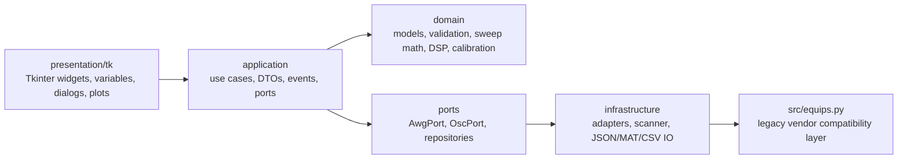
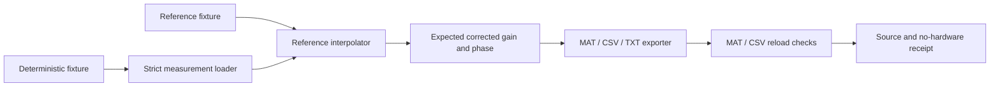

# Architecture

Auto-Load-off-Test is organized as a local desktop application with explicit boundaries between UI code, use-case orchestration, pure domain logic, persistence, and hardware side effects.

## Layer Diagram

```mermaid
flowchart LR
  UI["presentation/tk<br/>Tkinter widgets, variables, dialogs, plots"] --> APP["application<br/>use cases, DTOs, events, ports"]
  APP --> DOMAIN["domain<br/>models, validation, sweep math, DSP, calibration"]
  APP --> PORTS["ports<br/>AwgPort, OscPort, repositories"]
  PORTS --> INFRA["infrastructure<br/>adapters, scanner, JSON/MAT/CSV IO"]
  INFRA --> LEGACY["src/equips.py<br/>legacy vendor compatibility layer"]
```

## Layers

- `app/bootstrap.py`
  - Desktop composition root. Wires repositories, use cases, scanner, instrument factories, runtime paths, and the Tk controller.
- `app/offline.py`
  - Headless composition root for file analysis. Snapshots inputs and stages a complete report bundle without
    importing the desktop bootstrap, Tkinter, PyVISA, or production adapters.
- `app/presentation/tk`
  - Tk widgets, variable bindings, dialogs, chart rendering.
  - Consumes application events and dispatches user intents.
- `app/application`
  - Use-case orchestration for start/stop sweep, save/load, reference loading, and settings.
  - Emits typed events for UI; no Tk widgets or message boxes.
- `app/domain`
  - Pure dataclasses, enums, instrument capability profiles, capability preflight, strict data validation,
    sweep generation, DSP, calibration, plot-scale selection, and export array shaping.
- `app/infrastructure`
  - Adapter registry and wrappers around `src/equips.py`.
  - JSON settings and MAT/CSV/TXT persistence.

## Dependency Rules

Allowed:

- `presentation -> application`
- `application -> domain`
- `application -> ports`
- `infrastructure -> ports`
- `infrastructure -> domain`
- `infrastructure -> src/equips.py`

Forbidden:

- `domain` importing Tkinter, PyVISA, serial, or Matplotlib.
- `application` showing dialogs through `messagebox` or `filedialog`.
- UI or use cases accessing `src/equips.py` directly.

## Event Flow

1. UI collects parameters from `ViewModel`.
2. `TkController` maps the view model to `AppSettings`.
3. `SweepTaskRunner` starts `StartSweepUseCase` in a worker thread.
4. Use case emits:
   - `SweepStarted`
   - `SweepProgress`
   - `SweepDataUpdated`
   - `SweepWarning` / `SweepFailed`
   - `SweepCompleted` / `SweepStopped`
5. Controller polls the event queue on the Tk main thread via `after()` and updates UI safely.

## Instrument Access

- Supported model metadata is declared in `domain/instrument_capabilities.py`.
- Adapter construction goes through `infrastructure/instruments/adapter_registry.py`; unsupported model/role
  combinations fail before the legacy vendor layer is entered.
- Address resolution remains isolated in infrastructure and is injected into the controller/discovery service.
- AWG and OSC commands are executed through `AwgPort` and `OscPort` adapters.
- Explicit scanning is provided by `PyVisaResourceScanner` and the discovery/test-connect service. The desktop
  no longer starts a periodic `ConnectionMonitor`: resource visibility is not a connection test. Test-connect
  uses short `*IDN?` probes and does not start a sweep.
- `src/equips.py` is intentionally treated as a vendor compatibility layer. It contains legacy SCPI/serial behavior that should not be casually refactored without physical instrument verification.

## Persistence

- Settings: `__config__/settings.json`
- Measurement files: MAT/CSV/TXT plus optional plot PNG files
- Reference files: MAT

Runtime locations are centralized through `AppPaths` in `app/runtime/paths.py`.
They default to OS-specific per-user storage; `AUTO_LOAD_OFF_TEST_ROOT` is an explicit override. Read-only demo
resources use a separate resolver covering source, installed package, and PyInstaller layouts.
The offline command instead takes explicit input/reference and output paths; it does not require app runtime settings.

Measurement and reference loaders normalize data through `domain/data_validation.py`. Frequencies must be finite,
positive, unique, and strictly increasing; gain arrays must be finite and aligned; phase may be absent but cannot
contain infinity. Export validates the `SweepResult` again before writing.

## Offline Analysis Flow

1. `main.py analyze` parses explicit dataset, correction, coverage, and output choices.
2. `app/offline.py` copies and hashes input files in a private staging directory.
3. Existing loaders normalize the snapshots; `AnalyzeMeasurementUseCase` applies domain validation and optional
   offline reference interpolation. Unknown acquisition settings remain unknown.
4. `analysis_bundle.py` writes MAT/CSV/TXT with result metadata, an Agg-rendered plot, a static HTML report, and a
   versioned manifest. The manifest hashes inputs and generated artifacts; it does not hash itself.
5. Only a complete staged bundle is moved to a new destination. An exclusive local lock coordinates competing runs;
   existing directories are not overwritten. Interrupted processes can leave a stale lock for manual inspection.

Offline PCHIP interpolation is separate from the legacy sweep interpolator. Both reuse reference/measurement
validation, and zero/non-finite reference responses are rejected. Processing markers survive MAT/CSV export/reload;
known corrected data is protected against accidental double correction. See [offline_analysis.md](offline_analysis.md)
for numerical assumptions, provenance limits, and failure behavior.

## Desktop Operation Ownership

`TkController` owns one operation state: idle, loading, replay, analyzing, exporting, discovery, live, or stopping.
Non-Tk work runs in background jobs that return values/errors through the event queue. Widget access stays on
the Tk thread; plot controls remain usable while conflicting mutations are disabled.

`MeasurementWorkspace` owns uniquely named input snapshots. The controller keeps the original loaded document,
applied analysis options/reference snapshot, and displayed result separate. Apply cannot accidentally compound
correction, and Export cannot silently use pending selector changes or a different same-name file. Numeric UI
exports stage first and publish exclusively with exception rollback.

`FixtureReplay` is scheduler-driven file playback. Tokens invalidate stale callbacks after Stop/restart, and each
update is an independent partial result. It uses the normal plot/state path without constructing instrument ports.

Hardware startup receives a cancellation event created before scheduling. Per-point validation rejects invalid
or non-increasing measurements before append. Terminal events carry partial snapshots and termination metadata.
A separate cleanup lock serializes timeout cleanup and worker cleanup, so auto-save cannot race ahead of pending
output-off attempts. `SweepWorkerFinished` follows cleanup and save. Closing waits for the shutdown thread and
drains trailing warnings before closing the local rotating event log and window.

These are software ordering guarantees. Driver calls can still block, and no receipt proves electrical safety
or successful physical output-off.

## Hardware-Free Evidence Flow

```mermaid
flowchart LR
  FIXTURE["Deterministic fixture"] --> LOAD["Strict measurement loader"]
  REF["Reference fixture"] --> CAL["Reference interpolator"]
  LOAD --> CAL
  CAL --> EXPECTED["Expected corrected gain and phase"]
  EXPECTED --> EXPORT["MAT / CSV / TXT exporter"]
  EXPORT --> RELOAD["MAT / CSV reload checks"]
  RELOAD --> RECEIPT["Source and no-hardware receipt"]
```

The package smoke follows a smaller bundled-resource path: fixture/reference load, interpolation, export, reload,
and a JSON receipt. It intentionally does not initialize Tk, scan VISA resources, or construct production adapters.

## Test Strategy

The automated suite stays hardware-free through pure domain tests, fake ports, fake scanners/identity probes,
temporary export directories, and deterministic fixtures. CI exercises the suite on Linux, macOS, and Windows;
Windows additionally builds and runs the PyInstaller smoke. See [validation_matrix.md](validation_matrix.md) for the
exact claim boundary. Live instrument verification remains a separate future bench workflow.
